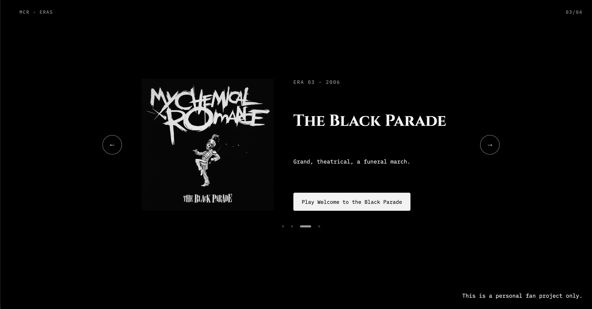

# MCR Eras 🖤
 
An interactive carousel that walks through the four album eras of My Chemical Romance. Each era changes the album art, title font, description, and featured song.
 
**🔗 Live site:** 🔗 Live site: demsingh30.github.io/MCR_carousel
 



 
---
 
## Features
 
- ← → arrows that loop around (Danger Days → Bullets and back)
- Each era updates the album art, title, year, description, and song button
- A unique title font for every era
- Header counter (`01/04`) and clickable dots that follow the current era
- Play/pause button for each era's song (the old song stops when you change eras)
- A color theme for each era, set with CSS variables
## Built With
 
- HTML
- CSS (Flexbox)
- Vanilla JavaScript (no frameworks)
## How It Works
 
All four eras live in one array of objects in `mcr.js`:
 
```js
const eras = [
  { year: 2002, title: '...', cover: '...', songName: '...' },
  ...
]
```
 
A single number, `currentAlbum`, keeps track of which era is showing. The arrows and dots change that number, and one function, `updateEra()`, repaints the whole page from the data. Nothing on the page is hardcoded per era.
 
## What I Learned

 
- **Arrays of objects:** `eras[currentAlbum].title` picks the album, then the detail
- **Separating data from display:** one function reads the data and updates the page, so adding a 5th era would only mean adding one object
- **Wrap-around logic:** move first, *then* check if you went past the end. I learned the order matters when the carousel kept skipping Bullets.
- **`classList`:** moving the `active` class between dots so CSS handles the styling
- **`forEach` with an index:** giving every dot its own click that knows its number
- **Audio:** one shared `Audio` player, with `play()`, `pause()`, and swapping `src`
- **CSS variables:** JS changes `--bg`, `--title`, and `--accent` on `:root` so the whole page recolors
- **Debugging with the Console:** tracking down a mismatched variable name and fixing layout shifts caused by changing text widths
## Run It Locally
 
1. Clone the repo
```bashlive link  → demsingh30.github.io/MCR_carousel
clone line → github.com/demsingh30/MCR_carousel.git
```
2. Open `index.html` in your browser
---
 
_This is a personal fan project made for learning. All album art and music belong to My Chemical Romance and their respective rights holders._
